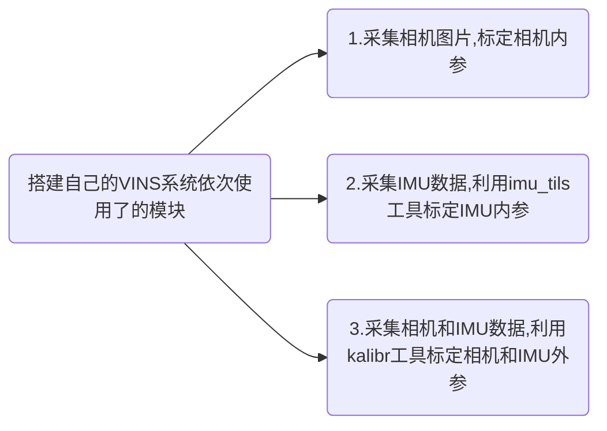
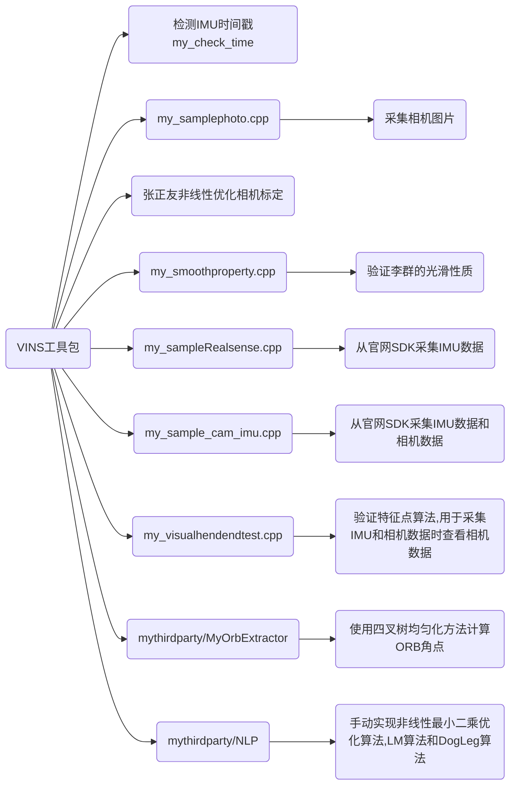

# Description



这个ros工具包主要记录搭建VINS系统会用到的工具模块。



## my_check_time的使用

用于检查IMU传感器的时间戳是否正确, 正常而言应该是线性增长的, 不排除有一些劣质传感器时间戳不对劲的情况

+ 运行对应的 my_check_time.launch文件即可
+ 1. Set the topic of imu message  and the multiple of time in checkSensorTime.launch.
  2. Run the checkSensorTime.launch.
  3. Play your rosbag.
  4. Open Plotjuggler to check the timestamp of sensor.

## 采集相机图片

采集相机图片，目前主要用于采集标定图片

> 源码：
>
> 1. my_samplephoto.cpp
> 2. my_sample.launch

> 需要修改的地方：
>
> 1. my_sample.launch 的4个参数

运行 my_sample.launch文件即可，摁'q'键用于保存图片。

## 张正友非线性优化相机标定

基于张正友标定法, 使用非线性优化框架进行相机标定。

源码：

> 1. my_calibration.cpp 和 my_calibration.h
> 2. my_calibration,launch

> 需要数据：
>
> 1. 以 1,2,3,4....  .jpg 命名的棋盘图像

> 需要修改的地方：
>
> 1. my_calibration.launch 文件的四个参数

> 运行：
>
> ```
> roslaunch my_utils my_calibration.launch
> ```
